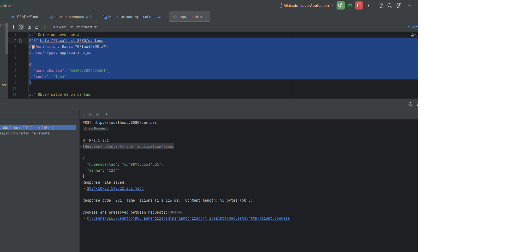
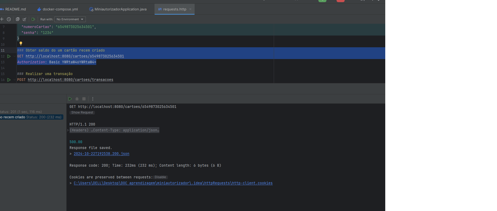
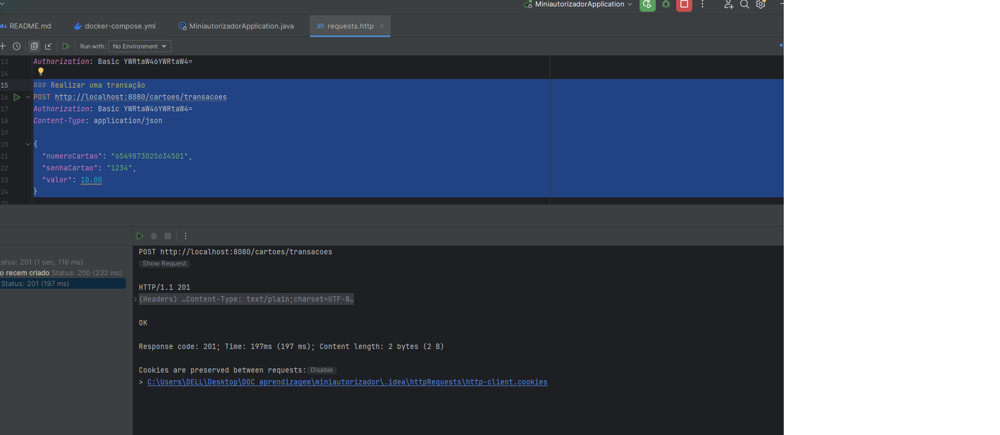
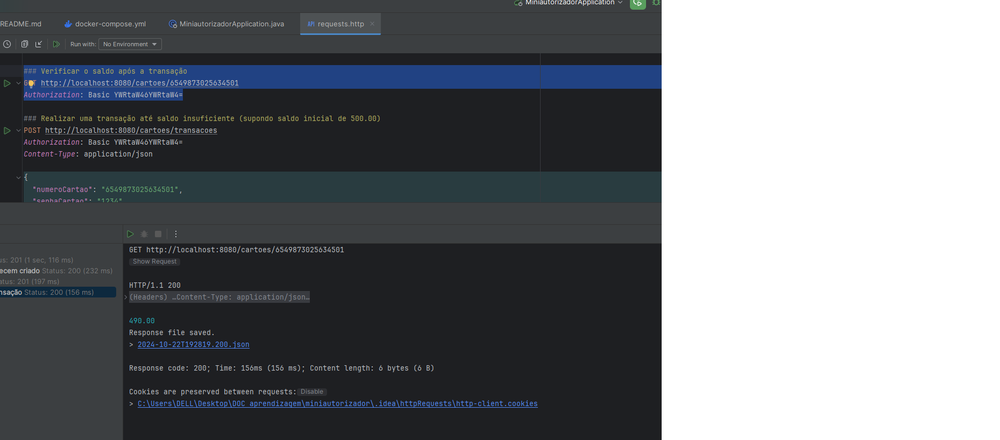
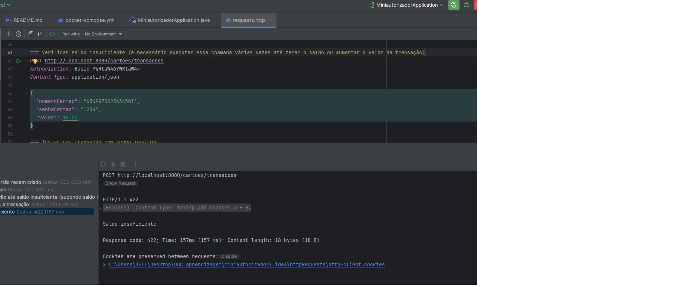
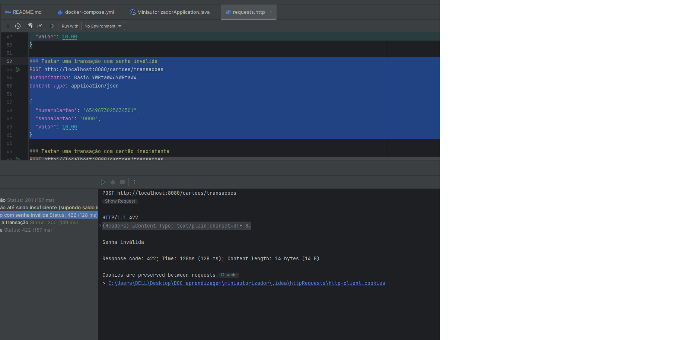
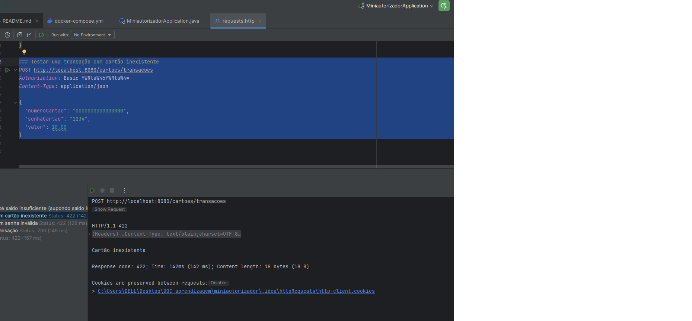
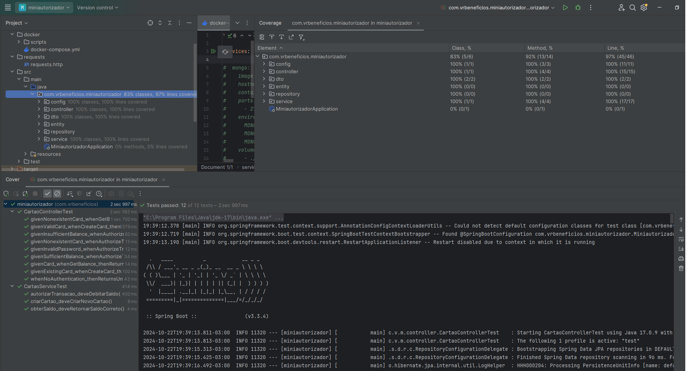

# Mini Autorizador - VR Benefícios
Este projeto foi desenvolvido como parte de um desafio para construir um mini-autorizador de transações de Vale Refeição e Vale Alimentação.

## Objetivo
O objetivo deste projeto é garantir que a aplicação possa ser executada em qualquer máquina seguindo as instruções descritas neste README. Certifique-se de que todos os pré-requisitos estão instalados e siga os passos abaixo cuidadosamente para rodar a aplicação com sucesso.

## Contexto do Desafio
O contexto completo do desafio, com todas as informações e requisitos, pode ser encontrado no arquivo [README-DESAFIO.md](./README-DESAFIO.md), localizado no diretório principal do projeto.

## Escolha do Banco de Dados
O projeto vem com um arquivo docker-compose.yml que inclui configurações para dois bancos de dados: um relacional (MySQL) e um não-relacional (MongoDB). Para este desafio, optei por utilizar o MySQL, deixando o MongoDB comentado no docker-compose.yml.

## Tecnologias Utilizadas

- **Java 17**
- **Spring Boot 3.3.4**
- **Spring Data JPA**
- **MySQL**
- **H2** (Para testes)
- **Maven**
- **Docker**

## Requisitos para execução

- **Docker** e **Docker Compose**
- **Java 17**
- **Maven**
 
### 1. Clonar o repositório:
```bash
git clone https://github.com/seu-usuario/miniautorizador.git
cd miniautorizador
```

### 2. Rodar o Docker Compose:
Navegue até a pasta `miniautorizador/docker`:
```bash
docker-compose up -d
```
Esse comando irá subir o banco de dados MySQL configurado no Docker Compose.

### 3.  Rodar a aplicação:
Após subir o MySQL com o Docker, execute a aplicação com o Maven ou suba a aplicação por meio da sua IDE.
(Utilizei a IDE InteliJJ)

 ### 4. Testando os Endpoints

##### Através do IntelliJ

No projeto, há um arquivo  [requests.http](./requests/requests.http)  localizado no diretório /requests, que pode ser utilizado para testar os endpoints diretamente no IntelliJ.
Para isso, após rodar o Docker Compose e a aplicação, basta abrir o arquivo requests.http e executar as requisições diretamente.
##### Através do Postman
Se preferir, você pode utilizar o Postman ou outra ferramenta para testar os endpoints manualmente.

Importante: Configure a autenticação básica (Basic Auth) com:
Username: admin
Password: admin

#### Documentação da API com Swagger

Esta aplicação inclui uma documentação interativa da API gerada automaticamente com Swagger. Para acessar e testar os endpoints, siga os seguintes passos:

1. Certifique-se de que a aplicação está rodando.
2. Acesse a seguinte URL no seu navegador:
   http://localhost:8080/swagger-ui.html
3. **Autenticação**: Ao acessar o Swagger, será solicitada a autenticação básica. Utilize as seguintes credenciais:
- **Username**: `admin`
- **Password**: `admin`

A partir dessa interface, você poderá visualizar os endpoints disponíveis, suas respectivas respostas e testar as chamadas diretamente pelo navegador também.


### Testes
##### Testes Unitários 
O projeto contém testes unitários utilizando Mockito para validar as regras de negócio isoladamente, garantindo a integridade dos métodos principais.
Os testes de unidade podem ser encontrados na classe: CartaoServiceTest.

##### Testes de Integração
Foram feitos testes de integração utilizando o banco em memória H2. Esses testes sobem todo o contexto do Spring Boot e simulam a aplicação rodando. Os testes de integração podem ser encontrados na classe:
CartaoControllerTest

#### Observações Finais
* Autenticação: Lembre-se de utilizar a autenticação básica ao testar os endpoints.
* Teste da aplicação: O arquivo requests.http oferece uma maneira prática de testar os contratos da API diretamente no IntelliJ. Nota: O arquivo .http foi testado utilizando a versão Professional do IntelliJ IDEA. Caso esteja utilizando a versão Community, essa funcionalidade pode não estar disponível. Nesse caso, sugiros utilizar ferramentas como o Postman para testar os endpoints.
* Banco de dados: Certifique-se de que o MySQL está rodando corretamente com o Docker antes de rodar a aplicação.

### 5. Prints dos Testes Realizados

Abaixo estão os prints dos testes realizados no arquivo `requests.http`, seguindo as instruções descritas anteriormente.

#### 1. Criar um novo cartão
Este teste valida a criação de um novo cartão, que começa com saldo de R$500,00.



#### 2. Obter saldo do cartão recém-criado
Valida a obtenção do saldo de um cartão recém-criado.



#### 3. Realização de transação de 10 reais para depois verificar o saldo
Realiza diversas transações e verifica o saldo até o sistema retornar saldo insuficiente.



#### 4. Obter saldo do cartão após transação de 10 reais
Realiza diversas transações e verifica o saldo até o sistema retornar saldo insuficiente.



#### 5. Realização de diversas transações até saldo insuficiente
Realiza diversas transações e verifica o saldo até o sistema retornar saldo insuficiente.




#### 6. Testar transação com senha inválida
Testa a realização de uma transação com uma senha inválida.



#### 7. Testar transação com cartão inexistente
Testa a tentativa de realizar uma transação com um cartão que não existe.



#### 8. Cobertura de código (Unitário e Integração)
Print da cobertura de código obtida pelos testes unitários e de integração.




```markdown
### Desafios opcionais (não implementados devido ao tempo)

Embora o projeto atenda aos requisitos principais, não implementei os desafios opcionais devido à limitação de tempo, 
mas aqui estão algumas considerações:

1. **Evitar o uso de if:** A solução poderia ser melhorada para eliminar o uso de condicionais `if`, aplicando conceitos avançados de orientação a objetos, 
como o uso de padrões de design como *Strategy* e *State*.

2. **Concorrência em transações simultâneas:** Para evitar problemas de concorrência em múltiplas transações simultâneas (ex.: duas transações de R$10,00 ao mesmo tempo em um cartão com saldo de R$10,00), 
seria possível utilizar a anotação `@Lock(LockModeType.PESSIMISTIC_WRITE)` no repositório de transações para garantir que apenas uma transação seja processada por vez.


